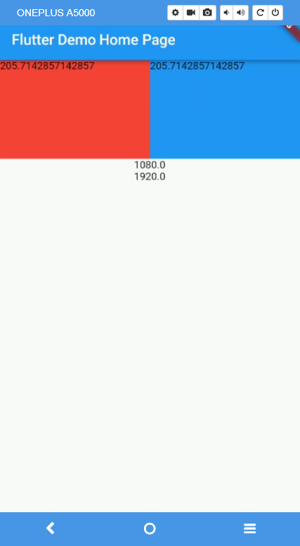

# flutter_ScreenUtil
flutter 屏幕适配方案

csdn博客本工具介绍:https://blog.csdn.net/u011272795/article/details/82795477

# 前言:

现在的手机品牌和型号越来越多，导致我们平时写布局的时候会在个不同的移动设备上显示的效果不同，

比如我们的设计稿一个View的大小是300px，如果直接写300px，可能在当前设备显示正常，但到了其他设备可能就会偏小或者偏大，这就需要我们对屏幕进行适配。

安卓原生的话有自己的适配规则，可以根据不同的尺寸建立不同的文件夹，系统会根据当前的设备尺寸取对应的大小的布局。而flutter本身并没有适配规则，而原生的又比较繁琐，这就需要我们自己去对屏幕进行适配。


使用方法:
```
import 'package:flutter_app/ScreenUtil.dart';  //导入

....
//传入设计稿的px尺寸
width: ScreenUtil().setWidth(540),
height: ScreenUtil().setHeight(200),

```

```
import 'package:flutter_app/ScreenUtil.dart';  //导入

@override
  Widget build(BuildContext context) {
    print(ScreenUtil.screenWidth); //设备宽度
    print(ScreenUtil.screenHeight); //设备高度

    print(ScreenUtil.pixelRatio); //设备的像素密度

    print(ScreenUtil.StatusBarHeight); //状态栏高度 刘海屏会更高
    print(ScreenUtil.BottomBarHeight); //底部安全区距离

    return new Scaffold(
      appBar: new AppBar(
        title: new Text(widget.title),
      ),
      body: Column(
        children: <Widget>[
          Row(
            children: <Widget>[
              Container(
                width: ScreenUtil().setWidth(540),
                height: ScreenUtil().setHeight(200),
                color: Colors.red,
                child: Text(ScreenUtil().setWidth(540).toString()),
              ),
              Container(
                width: ScreenUtil().setWidth(540),
                height: ScreenUtil().setHeight(200),
                color: Colors.blue,
                child: Text(ScreenUtil().setWidth(540).toString()),
              ),
            ],
          ),
          Text(ScreenUtil.screenWidth.toString()),
          Text(ScreenUtil.screenHeight.toString()),
        ],
      ),
    );
  }
```
效果:
上面的205.xxx 是dp的单位,
下面的单位是px



