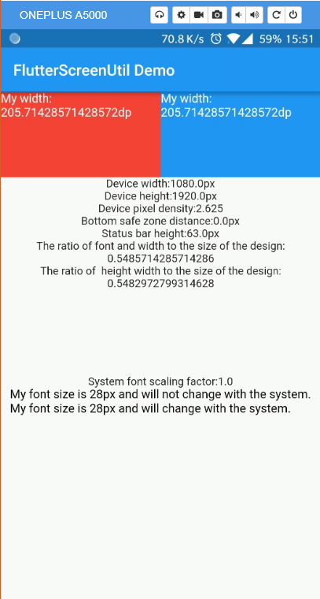

# flutter_screenutil
[](https://pub.dev/packages/flutter_screenutil)

**A flutter plugin for adapting screen and font size.Let your UI display a reasonable layout on different screen sizes!**

*Note*: This plugin is still under development, and some APIs might not be available yet.

[中文文档](https://github.com/OpenFlutter/flutter_screenutil/blob/master/README_CN.md)  

[README em Português](https://github.com/OpenFlutter/flutter_screenutil/blob/master/README_PT.md)

[github](https://github.com/OpenFlutter/flutter_screenutil)

[Update log](https://github.com/OpenFlutter/flutter_screenutil/blob/master/CHANGELOG.md)

## Usage:

### Add dependency：
Please check the latest version before installation.
If there is any problem with the new version, please use the previous version
```yaml
dependencies:
  flutter:
    sdk: flutter
  # add flutter_screenutil
  flutter_screenutil: ^{latest version}
```
### Add the following imports to your Dart code:
```dart
import 'package:flutter_screenutil/flutter_screenutil.dart';
```

### Property
   
|Property|Type|Default Value|Description|
|:---|:---|:---|:---| 
|designSize|Size|Size(360, 690)|The size of the device in the design draft, in dp|
|allowFontScaling|bool|false|Sets whether the font size is scaled according to the system's "font size" assist option|

### Initialize and set the fit size and font size to scale according to the system's "font size" accessibility option
Please set the size of the design draft before use, the width and height of the design draft.

The first way:
```dart
void main() => runApp(MyApp());

class MyApp extends StatelessWidget {
  @override
  Widget build(BuildContext context) {
    //Set the fit size (fill in the screen size of the device in the design,in dp)
    return ScreenUtilInit(
      designSize: Size(360, 690),
      allowFontScaling: false,
      builder: () => MaterialApp(
        ...
      ),
    );
  }
}
```
The second way:Does not support the use of font adaptation in the App
```
class MyApp extends StatelessWidget {
  @override
  Widget build(BuildContext context) {
    return MaterialApp(
      debugShowCheckedModeBanner: false,
      title: 'Flutter_ScreenUtil',
      theme: ThemeData(
        primarySwatch: Colors.blue,
      ),
      home: HomePage(title: 'FlutterScreenUtil Demo'),
    );
  }
}

class HomePage extends StatefulWidget {
  const HomePage({Key key, this.title}) : super(key: key);

  final String title;

  @override
  _HomePageState createState() => _HomePageState();
}

class _HomePageState extends State<HomePage> {
  @override
  Widget build(BuildContext context) {
    //Set the fit size (fill in the screen size of the device in the design) If the design is based on the size of the 360*690(dp)
    ScreenUtil.init(
        BoxConstraints(
            maxWidth: MediaQuery.of(context).size.width,
            maxHeight: MediaQuery.of(context).size.height),
        designSize: Size(360, 690),
        allowFontScaling: false,
        orientation: Orientation.portrait);
    return Scaffold();
  }
}
```

### Use：

### API

#### Pass the dp size of the design draft

```dart
    ScreenUtil().setWidth(540)  (dart sdk>=2.6 : 540.w) //Adapted to screen width
    ScreenUtil().setHeight(200) (dart sdk>=2.6 : 200.h) //Adapted to screen height , under normal circumstances, the height still uses x.w
    ScreenUtil().radius(200) (dart sdk>=2.6 : 200.r)    //Adapt according to the smaller of width or height
    ScreenUtil().setSp(24)      (dart sdk>=2.6 : 24.sp) //Adapter font
    ScreenUtil().setSp(24, allowFontScalingSelf: true)  (dart sdk>=2.6 : 24.ssp) //Adapter font(fonts will scale to respect Text Size accessibility settings)
    ScreenUtil().setSp(24, allowFontScalingSelf: false) (dart sdk>=2.6 : 24.nsp) //Adapter font(fonts will not scale to respect Text Size accessibility settings)

    ScreenUtil().pixelRatio       //Device pixel density
    ScreenUtil().screenWidth   (dart sdk>=2.6 : 1.sw)    //Device width
    ScreenUtil().screenHeight  (dart sdk>=2.6 : 1.sh)    //Device height
    ScreenUtil().bottomBarHeight  //Bottom safe zone distance, suitable for buttons with full screen
    ScreenUtil().statusBarHeight  //Status bar height , Notch will be higher
    ScreenUtil().textScaleFactor  //System font scaling factor

    ScreenUtil().scaleWidth //The ratio of actual width to UI design
    ScreenUtil().scaleHeight //The ratio of actual height to UI design

    ScreenUtil().orientation  //Screen orientation
    0.2.sw  //0.2 times the screen width
    0.5.sh  //50% of screen height
```

#### Adapt screen size：

Pass the dp size of the design draft((The unit is the same as the unit at initialization))：

Adapted to screen width: `ScreenUtil().setWidth(540)`,

Adapted to screen height: `ScreenUtil().setHeight(200)`, In general, the height is best to adapt to the width

If your dart sdk>=2.6, you can use extension functions:

example:

instead of :
```dart
Container(
width: ScreenUtil().setWidth(50),
height:ScreenUtil().setHeight(200),
)
```
you can use it like this:
```dart
Container(
width: 50.w,
height:200.h
)
```
**Note** 

The height can also use setWidth to ensure that it is not deformed(when you want a square)

The setHeight method is mainly to adapt to the height, which is used when you want to control the height of a screen on the UI to be the same as the actual display.

Generally speaking, 50.w!=50.h.

```dart
//for example:

///If you want to display a square:
///The UI may show a rectangle:
Container(
           width: 375.w,
           height: 375.h,
            ),
            
////If you want to display a square:
Container(
           width: 300.w,
           height: 300.w,
            ),

or

Container(
           width: 300.r,
           height: 300.r,
            ),
```


#### Adapter font:
``` dart
//Incoming font size(The unit is the same as the unit at initialization), fonts will not scale to respect Text Size accessibility settings
//(AllowallowFontScaling when initializing ScreenUtil)
ScreenUtil().setSp(28) 
28.sp   
     
//Incoming font size，the unit is pixel，fonts will scale to respect Text Size accessibility settings
//(If somewhere follow the global allowFontScaling setting)
ScreenUtil().setSp(24, allowFontScalingSelf: true)
28.ssp

//(If somewhere does not follow the global allowFontScaling setting)
ScreenUtil().setSp(24, allowFontScalingSelf: false)
28.nsp

//for example:
Column(
              crossAxisAlignment: CrossAxisAlignment.start,
              children: <Widget>[
                Text(
                    'My font size is 24dp on the design draft and will not change with the system.',
                    style: TextStyle(
                      color: Colors.black,
                      fontSize: ScreenUtil().setSp(24),
                    )),
                Text(
                    'My font size is 24dp on the design draft and will change with the system.',
                    style: TextStyle(
                        color: Colors.black,
                        fontSize: ScreenUtil()
                            .setSp(24, allowFontScalingSelf: true))),
              ],
            )
```

#### Setting font does not change with system font size

```
 MaterialApp(
        debugShowCheckedModeBanner: false,
        title: 'Flutter_ScreenUtil',
        theme: ThemeData(
          primarySwatch: Colors.blue,
        ),
        builder: (context, widget) {
          return MediaQuery(
            ///Setting font does not change with system font size
            data: MediaQuery.of(context).copyWith(textScaleFactor: 1.0),
            child: widget,
          );
        },
        home: HomePage(title: 'FlutterScreenUtil Demo'),
      ),
```

[widget test](https://github.com/OpenFlutter/flutter_screenutil/issues/115)

### Example:

[example demo](https://github.com/OpenFlutter/flutter_screenutil/blob/master/example/lib/main.dart)
 
### Effect:



