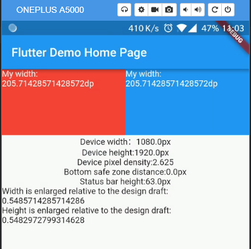

# flutter_ScreenUtil
**A flutter plugin for screen adaptation**

[中文文档](https://github.com/OpenFlutter/flutter_ScreenUtil/blob/master/README_CN.md)

github: https://github.com/OpenFlutter/flutter_ScreenUtil


## Usege:

### Add dependency：
Please check the latest version before installation.
```
dependencies:
  flutter:
    sdk: flutter
  # add flutter_ScreenUtil
  flutter_screenutil: ^0.2.3
```

### Add the following imports to your Dart code:
```
import 'package:flutter_screenutil/flutter_screenutil.dart';
```

### Initialize the setup size
Please set the width and height of the design draft before use, the width and height of the design draft (unit px).
If not set, the default size is used. The default is 1080*1920.
Be sure to set the page in the MaterialApp's home to ensure that the fit size is set before each use:

```
//Set the fit size (fill in the screen size of the device in the design)
//If the design is based on the size of the iPhone6 ​​(iPhone6 ​​750*1334)
ScreenUtil.instance = ScreenUtil(width: 750, height: 1334)..init(context);
```

### Use：

Fit size：
```
Pass the px size of the design draft：

Width after adaptation: ScreenUtil().setWidth(540),
Height after adaptation: ScreenUtil().setHeight(200),

//for example:
Container(
           width: ScreenUtil().setWidth(375),
           height: ScreenUtil().setHeight(200),
           ...
            ),
```

Other related apis：
```
    ScreenUtil.pixelRatio       //Device pixel density
    ScreenUtil.screenWidth      //Device width
    ScreenUtil.screenHeight     //Device height
    ScreenUtil.bottomBarHeight  //Bottom safe zone distance, suitable for buttons with full screen
    ScreenUtil.statusBarHeight  //Status bar height , Notch will be higher Unit px

    ScreenUtil().scaleWidth //The width is enlarged relative to the design draft
    ScreenUtil().scaleHeight //Height relative to the magnification of the design draft

```

```
//import
import 'package:flutter_screenutil/flutter_screenutil.dart';

...

 @override
  Widget build(BuildContext context) {
    //Set the fit size (fill in the screen size of the device in the design) If the design is based on the size of the iPhone6 ​​(iPhone6 ​​750*1334)
    ScreenUtil.instance = ScreenUtil(width: 750, height: 1334)..init(context);
    print('Device width:${ScreenUtil.screenWidth}'); //Device width
    print('Device height:${ScreenUtil.screenHeight}'); //Device height
    print('Device pixel density:${ScreenUtil.pixelRatio}'); //Device pixel density
    print('Bottom safe zone distance:${ScreenUtil.bottomBarHeight}'); //Bottom safe zone distance，suitable for buttons with full screen
    print('Status bar height:${ScreenUtil.statusBarHeight}px'); //Status bar height , Notch will be higher Unit px
    print('The width is enlarged relative to the design draft:${ScreenUtil().scaleWidth}'); //The width is enlarged relative to the design draft
    print('Height relative to the magnification of the design draft:${ScreenUtil().scaleHeight}'); //Height relative to the magnification of the design draft

    return new Scaffold(
      appBar: new AppBar(
        title: new Text(widget.title),
      ),
      body: new Center(
        child: Column(
          children: <Widget>[
            Row(
              children: <Widget>[
                Container(
                  width: ScreenUtil().setWidth(375),
                  height: ScreenUtil().setHeight(200),
                  color: Colors.red,
                  child: Text(
                    'My width:${ScreenUtil().setWidth(375)}dp',
                    style: TextStyle(color: Colors.white),
                  ),
                ),
                Container(
                  width: ScreenUtil().setWidth(375),
                  height: ScreenUtil().setHeight(200),
                  color: Colors.blue,
                  child: Text('My width:${ScreenUtil().setWidth(375)}dp',
                      style: TextStyle(color: Colors.white)),
                ),
              ],
            ),
            Text('Device width：${ScreenUtil.screenWidth}px'),
            Text('Device height:${ScreenUtil.screenHeight}px'),
            Text('Device pixel density:${ScreenUtil.pixelRatio}'),
            Text('Bottom safe zone distance:${ScreenUtil.bottomBarHeight}px'),
            Text('Status bar height:${ScreenUtil.statusBarHeight}px'),
            Text('The width is enlarged relative to the design draft:${ScreenUtil().scaleWidth}'),
            Text('Height relative to the magnification of the design draft:${ScreenUtil().scaleHeight}'),
          ],
        ),
      ),
    );
  }
```

### example:

[example demo](https://github.com/OpenFlutter/flutter_ScreenUtil/blob/master/example)
 
effect:



