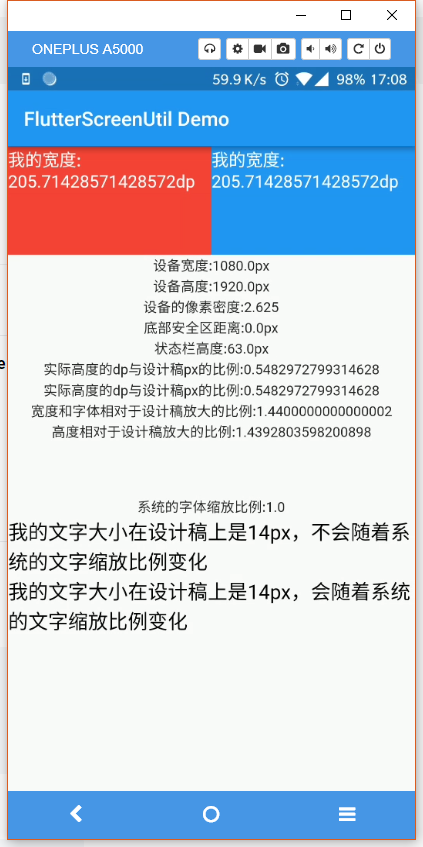

# flutter_screenUtil

[](https://pub.dartlang.org/packages/flutter_screenutil)

**flutter 屏幕适配方案，让你的UI在不同尺寸的屏幕上都能显示合理的布局!**


*注意*：此插件仍处于开发阶段，某些API可能尚未推出。

[README of English](https://github.com/OpenFlutter/flutter_ScreenUtil/blob/master/README.md)

[README em Português](https://github.com/OpenFlutter/flutter_screenutil/blob/master/README_PT.md)

[github](https://github.com/OpenFlutter/flutter_screenutil)

[csdn博客工具介绍](https://blog.csdn.net/u011272795/article/details/82795477)

[更新日志](https://github.com/OpenFlutter/flutter_screenutil/blob/master/CHANGELOG.md)

## 使用方法:

### 安装依赖：

安装之前请查看最新版本
新版本如有问题请使用上一版
```yaml
dependencies:
  flutter:
    sdk: flutter
  # 添加依赖
  flutter_screenutil: ^{latest version}
```
### 在每个使用的地方导入包：
```dart
import 'package:flutter_screenutil/flutter_screenutil.dart';
```

### 属性

|属性|类型|默认值|描述|
|:---|:---|:---|:---|
|designSize|Size|Size(360, 690)|设计稿中设备的尺寸(单位随意,但在使用过程中必须保持一致)|
|allowFontScaling|bool|false|设置字体大小是否根据系统的“字体大小”辅助选项来进行缩放|

### 初始化并设置适配尺寸及字体大小是否根据系统的“字体大小”辅助选项来进行缩放
在使用之前请设置好设计稿的宽度和高度，传入设计稿的宽度和高度(单位随意,但在使用过程中必须保持一致)
一定要进行初始化(只需设置一次),以保证在每次使用之前设置好了适配尺寸:

方式一:
```dart
void main() => runApp(MyApp());

class MyApp extends StatelessWidget {
  @override
  Widget build(BuildContext context) {
    //填入设计稿中设备的屏幕尺寸,单位dp
    return ScreenUtilInit(
      designSize: Size(360, 690),
      allowFontScaling: false,
      builder: () => MaterialApp(
        debugShowCheckedModeBanner: false,
        title: 'Flutter_ScreenUtil',
        theme: ThemeData(
          primarySwatch: Colors.blue,
        ),
        home: HomePage(title: 'FlutterScreenUtil Demo'),
      ),
    );
  }
}
```
方式二: 不支持在App中使用字体适配
```
class MyApp extends StatelessWidget {
  @override
  Widget build(BuildContext context) {
    return MaterialApp(
      debugShowCheckedModeBanner: false,
      title: 'Flutter_ScreenUtil',
      theme: ThemeData(
        primarySwatch: Colors.blue,
      ),
      home: HomePage(title: 'FlutterScreenUtil Demo'),
    );
  }
}

class HomePage extends StatefulWidget {
  const HomePage({Key key, this.title}) : super(key: key);

  final String title;

  @override
  _HomePageState createState() => _HomePageState();
}

class _HomePageState extends State<HomePage> {
  @override
  Widget build(BuildContext context) {
    //设置尺寸（填写设计中设备的屏幕尺寸）如果设计基于360dp * 690dp的屏幕
    ScreenUtil.init(
        BoxConstraints(
            maxWidth: MediaQuery.of(context).size.width,
            maxHeight: MediaQuery.of(context).size.height),
        designSize: Size(360, 690),
        allowFontScaling: false,
        orientation: Orientation.portrait);
    return Scaffold();
  }
}
```

### 使用

### API
#### 传入设计稿的dp尺寸
```dart
    ScreenUtil().setWidth(540)  (sdk>=2.6 : 540.w)   //根据屏幕宽度适配尺寸
    ScreenUtil().setHeight(200) (sdk>=2.6 : 200.h)   //根据屏幕高度适配尺寸(一般根据宽度适配即可)
    ScreenUtil().radius(200)    (sdk>=2.6 : 200.r)   //根据宽度或高度中的较小者进行调整
    ScreenUtil().setSp(24)      (sdk>=2.6 : 24.sp)   //适配字体
    ScreenUtil().setSp(24, allowFontScalingSelf: true)   (sdk>=2.6 : 24.ssp) //适配字体(根据系统的“字体大小”辅助选项来进行缩放)
    ScreenUtil().setSp(24, allowFontScalingSelf: false)  (sdk>=2.6 : 24.nsp) //适配字体(不会根据系统的“字体大小”辅助选项来进行缩放)

    ScreenUtil.pixelRatio       //设备的像素密度
    ScreenUtil.screenWidth   (sdk>=2.6 : 1.sw)   //设备宽度
    ScreenUtil.screenHeight  (sdk>=2.6 : 1.sh)   //设备高度
    ScreenUtil.bottomBarHeight  //底部安全区距离，适用于全面屏下面有按键的
    ScreenUtil.statusBarHeight  //状态栏高度 刘海屏会更高
    ScreenUtil.textScaleFactor //系统字体缩放比例

    ScreenUtil().scaleWidth  // 实际宽度设计稿宽度的比例
    ScreenUtil().scaleHeight // 实际高度与设计稿高度度的比例

    ScreenUtil().orientation  //屏幕方向

    0.2.sw  //屏幕宽度的0.2倍
    0.5.sh  //屏幕高度的50%
```


#### 适配尺寸

传入设计稿的尺寸(单位与初始化时的单位相同)：

根据屏幕宽度适配 `width: ScreenUtil().setWidth(540)`,

根据屏幕高度适配 `height: ScreenUtil().setHeight(200)`, 一般来说，控件高度也根据宽度进行适配

一般来说，50.w!=50.h

**注意**

高度也根据setWidth来做适配可以保证不变形(当你想要一个正方形的时候)

setHeight方法主要是在高度上进行适配, 在你想控制UI上一屏的高度与实际中显示一样时使用.

例如:

```dart
//UI可能显示长方形:
Container(
           width: 375.w,
           height: 375.h,
            ),
            
//如果你想显示一个正方形:
Container(
           width: 300.r,
           height: 300.r,
            ),
```

如果你的dart sdk>=2.6,可以使用扩展函数:
example:
不用这个:
```dart
Container(
width: ScreenUtil().setWidth(50),
height:ScreenUtil().setHeight(200),
)
```
而是用这个:
```dart
Container(
width: 50.w,
height:200.h
)
```

#### 适配字体:
传入设计稿的字体大小：

```dart 
//传入字体大小(单位和初始化时的单位保持一致)，默认不根据系统的“字体大小”辅助选项来进行缩放(可在初始化ScreenUtil时设置allowFontScaling)
ScreenUtil().setSp(28)
或
28.sp (dart sdk>=2.6)
 
//传入字体大小，根据系统的“字体大小”辅助选项来进行缩放(如果某个地方不遵循全局的allowFontScaling设置)       
ScreenUtil().setSp(24, allowFontScalingSelf: true)
或
24.ssp (dart sdk>=2.6)


//for example:

Column(
              crossAxisAlignment: CrossAxisAlignment.start,
              children: <Widget>[
                Text('我的文字大小在设计稿上是24dp，不会随着系统的文字缩放比例变化',
                    style: TextStyle(
                      color: Colors.black,
                      fontSize: ScreenUtil().setSp(24),
                    )),
                Text('我的文字大小在设计稿上是24dp，会随着系统的文字缩放比例变化',
                    style: TextStyle(
                        color: Colors.black,
                        fontSize: ScreenUtil()
                            .setSp(24, allowFontScalingSelf: true))),
              ],
            )
```

#### 设置字体不随系统字体大小进行改变

```
 MaterialApp(
        debugShowCheckedModeBanner: false,
        title: 'Flutter_ScreenUtil',
        theme: ThemeData(
          primarySwatch: Colors.blue,
        ),
        builder: (context, widget) {
          return MediaQuery(
            ///设置文字大小不随系统设置改变
            data: MediaQuery.of(context).copyWith(textScaleFactor: 1.0),
            child: widget,
          );
        },
        home: HomePage(title: 'FlutterScreenUtil Demo'),
      ),
```


[widget test](https://github.com/OpenFlutter/flutter_screenutil/issues/115)

### 使用示例:

[example demo](https://github.com/OpenFlutter/flutter_ScreenUtil/blob/master/example/lib/main_zh.dart)
 
效果:



