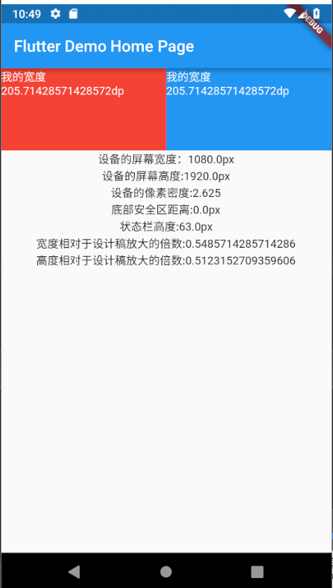

# flutter_ScreenUtil
**flutter 屏幕适配方案**

[README of English](/README.md)

github: https://github.com/OpenFlutter/flutter_ScreenUtil

csdn博客工具介绍:https://blog.csdn.net/u011272795/article/details/82795477


## 使用方法:

### 安装依赖：

安装之前请查看最新版本
```
dependencies:
  flutter:
    sdk: flutter
  # 添加依赖
  flutter_screenutil: ^0.2.2
```

### 在每个使用的地方导入包：
```
import 'package:flutter_screenutil/flutter_screenutil.dart';

```

### 初始化设置尺寸
在使用之前请设置好设计稿的宽度和高度，传入设计稿的宽度和高度(单位px)
如果不设置则使用默认尺寸，默认为1080*1920
一定在MaterialApp的home中的页面设置，以保证在每次使用之前设置好了适配尺寸:

```
//设置适配尺寸 (填入设计稿中设备的屏幕尺寸) 假如设计稿是按iPhone6的尺寸设计的(iPhone6 750*1334)
    ScreenUtil.instance = ScreenUtil(width: 750, height: 1334)..init(context);
```

### 使用：

适配尺寸：
```
//传入设计稿的px尺寸：
适配后的宽度width: ScreenUtil().setWidth(540),
适配后的高度height: ScreenUtil().setHeight(200),

例如:
Container(
           width: ScreenUtil().setWidth(375),
           height: ScreenUtil().setHeight(200),
            ),
```

其他相关api：
```
    ScreenUtil.pixelRatio       //设备的像素密度
    ScreenUtil.screenWidth    //设备宽度
    ScreenUtil.screenHeight    //设备高度
    ScreenUtil.bottomBarHeight //底部安全区距离，适用于全面屏下面有按键的
    ScreenUtil.statusBarHeight //状态栏高度 刘海屏会更高  单位px

    ScreenUtil().scaleWidth //宽度相对于设计稿放大的倍数
    ScreenUtil().scaleHeight //高度相对于设计稿放大的倍数

```

```
//导入
import 'package:flutter_screenutil/flutter_screenutil.dart';

...

 @override
  Widget build(BuildContext context) {
    //设置适配尺寸 (填入设计稿中设备的屏幕尺寸) 假如设计稿是按iPhone6的尺寸设计的(iPhone6 750*1334)
    ScreenUtil.instance = ScreenUtil(width: 750, height: 1334)..init(context);
    print('设备宽度:${ScreenUtil.screenWidth}'); //设备宽度
    print('设备高度:${ScreenUtil.screenHeight}'); //设备高度
    print('设备的像素密度:${ScreenUtil.pixelRatio}'); //设备的像素密度
    print('底部安全区距离:${ScreenUtil.bottomBarHeight}'); //底部安全区距离，适用于全面屏下面有按键的
    print('状态栏高度:${ScreenUtil.statusBarHeight}px'); //状态栏高度 刘海屏会更高
    print('宽度相对于设计稿放大的倍数:${ScreenUtil().scaleWidth}'); //宽度相对于设计稿放大的倍数
    print('高度相对于设计稿放大的倍数:${ScreenUtil().scaleHeight}'); //高度相对于设计稿放大的倍数

    return new Scaffold(
      appBar: new AppBar(
        title: new Text(widget.title),
      ),
      body: new Center(
        child: Column(
          children: <Widget>[
            Row(
              children: <Widget>[
                Container(
                  width: ScreenUtil().setWidth(375),
                  height: ScreenUtil().setHeight(200),
                  color: Colors.red,
                  child: Text(
                    '我的宽度${ScreenUtil().setWidth(375)}dp',
                    style: TextStyle(color: Colors.white),
                  ),
                ),
                Container(
                  width: ScreenUtil().setWidth(375),
                  height: ScreenUtil().setHeight(200),
                  color: Colors.blue,
                  child: Text('我的宽度${ScreenUtil().setWidth(375)}dp',
                      style: TextStyle(color: Colors.white)),
                ),
              ],
            ),
            Text('设备的屏幕宽度：${ScreenUtil.screenWidth}px'),
            Text('设备的屏幕高度:${ScreenUtil.screenHeight}px'),
            Text('设备的像素密度:${ScreenUtil.pixelRatio}'),
            Text('底部安全区距离:${ScreenUtil.bottomBarHeight}px'),
            Text('状态栏高度:${ScreenUtil.statusBarHeight}px'),
            Text('宽度相对于设计稿放大的倍数:${ScreenUtil().scaleWidth}'),
            Text('高度相对于设计稿放大的倍数:${ScreenUtil().scaleHeight}'),
          ],
        ),
      ),
    );
  }
```

### 使用示例:

[example demo](/example)
 
效果:



